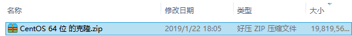
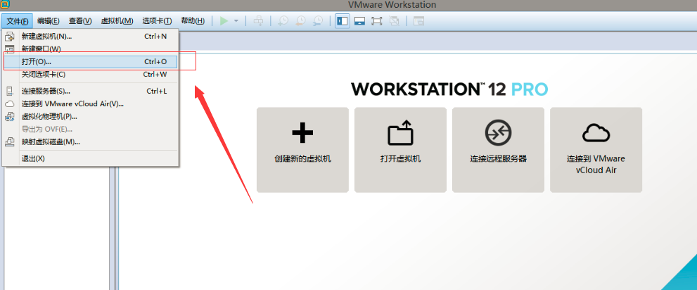

## 项目实践2：实践环境搭建

本次课程我们使用了Cloudera公司提供的大数据组件，简称CDH。相比Apache社区版本的Hadoop，CDH在兼容性、安全性和稳定性方面都有一定程度的提高。因此这里也建议同学们根据下面的说明进行安装。

### 方法一：使用虚拟机安装

通过VMware创建一个CentOS 7系统，安装CDH后把系统导出成镜像，大家可以通过在VMware的workstation上载入该镜像即可完成安装。
虚拟机备份文件，直接解压（耗时20分钟）

打开VMware，文件 -> 打开，选择刚刚解压的文件夹，打开文件夹，选择  CentOS 64 位 的克隆.vmx。打开后，VMware中已经出现了centOS 64 位的克隆，之后选择开机即可。

### 方法二：使用CentOS 7安装

具体详见：https://www.cloudera.com/documentation/enterprise/latest/topics/install_cm_cdh.html
